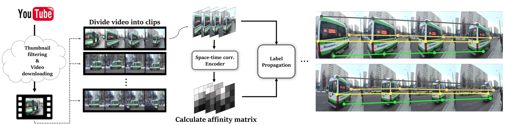

# Self-supervised Learning of Semantic Correspondence Using Web Videos

[Our paper](https://openaccess.thecvf.com/content/WACV2024/papers/Kwon_Self-Supervised_Learning_of_Semantic_Correspondence_Using_Web_Videos_WACV_2024_paper.pdf), [Project page](https://cvlab.postech.ac.kr/research/SSSCWEB/)

*Donghyeon Kwon, Minsu Cho and Suha Kwak*

> kinux98@postech.ac.kr

This repository contains the official implementation of : 
> Self-supervised Learning of Semantic Correspondence Using Web Videos
> 
that has been accepted to 2024 IEEE/CVF Winter Conference on Applications of Computer Vision (WACV 2024).


<div align="center">
  
</div>

## Highlights

• We present the first attempt to utilize web videos for learning semantic correspondence in a self-supervised learning manner.

• We provide a fully automatic process for dataset construction and labeling using web videos. Our strategy exploits the exclusive advantages of videos over images for generating accurate pseudo-correspondence labels.

• Our method outperformed existing self-supervised learning models and even substantially improved supervised learning performance through transfer learning.

## Requirements
The repository is tested on Ubuntu 20.04.1 LTS, Python 3.8.16, and PyTorch 2.0.1+cu117. We use four NVIDIA RTX 6000 Ada Generation (49GB for each) for training.

After preparing the virtual environment, download requirements packages with : 

> pip install requirements.txt

or

> conda --name SSSCWEB --file requirements_conda_ver.txt

### wandb settings

Before starting, you should login wandb using your personal API key.

>wandb login PERSONAL_API_KEY


# Data Preparation

## Web Video Download

Before getting started, you need to download YouTube videos to generate pseudo-correspondence labels. You can download the videos from the following link: [Download Link](https://postechackr-my.sharepoint.com/:u:/g/personal/kinux98_postech_ac_kr/EQDZT5o3OTxPmqr0gbKCgBgBVWly44pl_5FY4C1cfIFrPA?e=GVNxjL) (total 46.5GB).

Alternatively, you may download web videos by yourself using the provided codes in the `youtube_download` folder. To do this, modify the `class_list` in `common.py`. Then, run `GetURL.py`. It will download the searched video YouTube IDs (not the videos themselves) and their meta-info with thumbnail images.

Finally, run `youtube_downloader.py` with the proper path. It will automatically download YouTube videos based on the provided meta-info.

## Video Frame Extraction

After downloading videos, you need to extract frames from each video. To do this, run `extract_shot_multi.py` in the `video_preprocess` folder. You can modify `root`, `video_dir`, and `image_dir` to the proper paths. Also, you can change `process_num` to an appropriate value (it will extract each video's frame in a multi-threading manner).

If you have downloaded YouTube videos by yourself, please prepare your version of the `parsing.json` file. You can create it by uncommenting lines 91-92 in `extract_shot_multi.py` in the `video_preprocess` folder.

## Pseudo Label Generation

Now that we have extracted frames, it's time to generate pseudo-correspondence labels. Run the following command in the `frame_preprocess` folder:

```bash
python youtube_mp.py --resume=/your/path/checkpoints/youtube_consecutive/checkpoint.pth
```

You may change `root`, `json_file`, `image_set`, and `video_which` to the proper paths in youtube_mp.py. It will generate pseudo-correspondence labels in the results folder. Note that we have already provided video_scene_parsiong_new_mt.json for our videos.

# Training

Before training, please prepare SPair-71K, PF-PASCAL, and PF-WILLOW datasets for yourself.

For SPair-71K, run:

```bash
python train.py --snapshots=./snapshots/unsup_spair --run_yt=True --run_sb=False --run_dann=True --run_contra=False --benchmark=spair --eval_benchmark=spair --feature-size=24
```

For PF-PASCAL and PF-WILLOW, run:

```bash
python train.py --snapshots=./snapshots/unsup_pfpascal_pfwillow --run_yt=True --run_sb=False --run_dann=True --run_contra=False --benchmark=pfpascal --eval_benchmark=pfpascal --eval_benchmark2=pfwillow
```

## Citation

If you find this project useful, please consider citing it as follows:
```
@InProceedings{Kwon_2024_WACV,
    author    = {Kwon, Donghyeon and Cho, Minsu and Kwak, Suha},
    title     = {Self-Supervised Learning of Semantic Correspondence Using Web Videos},
    booktitle = {Proceedings of the IEEE/CVF Winter Conference on Applications of Computer Vision (WACV)},
    month     = {January},
    year      = {2024},
    pages     = {2142-2152}
}
```
## Acknowledgements

We borrowed some code from:

- https://github.com/SunghwanHong/Cost-Aggregation-transformers
- https://github.com/ajabri/videowalk
